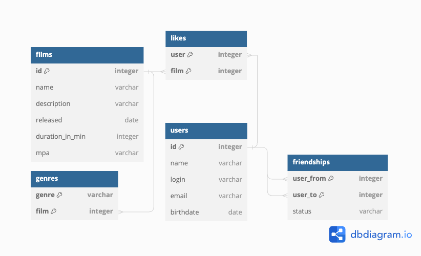

# Приложение Filmorate

## Описание базы данных

### Изображение схемы БД:


### DBML описание:
```
Table films {
id integer [primary key]
name varchar
description varchar
releaseDate date
duration_in_min integer
mpa varchar
}
```
> **Примечание**
> 
> Поле "MPA" не было выделено в отдельную таблицу,
> так как количество возможных значений мало, а фильм
> может иметь только одно значение рейтинга
> (в одной классификации).
```
Table users {
id integer [primary key]
name varchar
login varchar
email varchar
birthday date
}
```
```
Table friendships {
user_from integer [primary key]
user_to integer [primary key]
status varchar
}
```
> **Примечание**
> 
> В таблице "friendship" используется составной ключ,
> так как пара user_from и user_to уникальна.<br>
> Поле "status" добавлено только согласно условию.
> Состояние "дружбы" между пользователями можно оценить
> по наличию или отсутствию перекрёстных записей.
```
Table likes {
user integer [primary key]
film integer [primary key]
}
```
> **Примечание**
> 
> "Лайки" имеют составной ключ, так как пара user-film
> уникальна по условию. <br>Дополнительно, можно хранить поле
> "value" отображающее качество "лайка". Пример - лайк(+1)
> и дизлайк(-1).
```
Table genres {
genre varchar [primary key]
film integer [primary key]
}
```
> **Примечание**
> 
> Таблица "жанры" могла повторять структуру из учебных
> материалов - отдельно таблица с жанрами и таблица
> отображения жанров с фильмами.<br>
> Однако, множество "жанров" невелико, и проще и эффективнее
> сразу их записывать в одну таблицу с принадлежностью к фильмам.
```
Ref: films.id < genres.film
Ref: users.id < friendships.user_to
Ref: users.id < friendships.user_from
Ref: likes.user > users.id
Ref: likes.film > films.id
```
